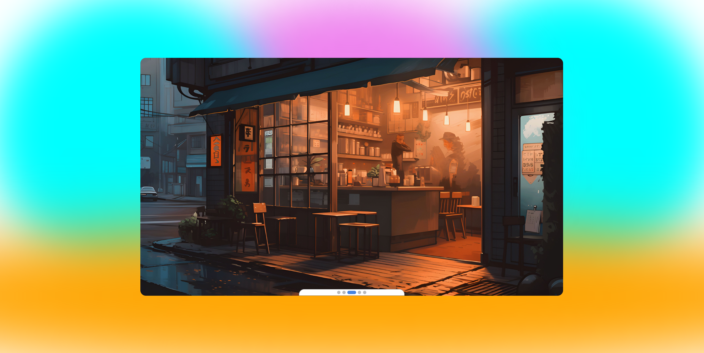

# Hellow , Welcome back 

## This Project 
- It is an interesting mini-project to practice JavaScript
- It is not used in real projects due to the lack of touch events
- In this project, only the **click event** is set for the buttons

## What is the purpose of this project ?
The main focus of this project is on writing the **algorithm of the buttons** and it is the practice of the introductory topics of JavaScript